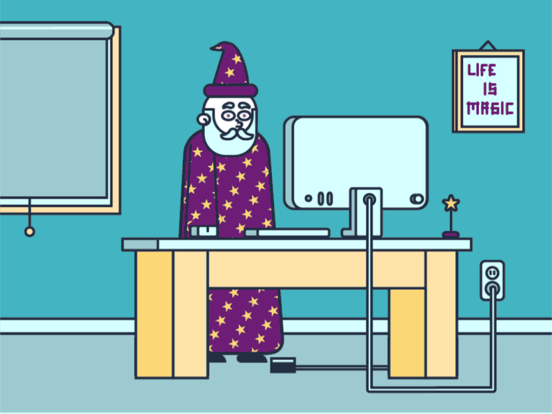

<h1 align="center">𝙶𝚛𝚎𝚎𝚝𝚒𝚗𝚐𝚜 𝙽𝚎𝚛𝚍𝚜, 𝙸𝚝 𝚒𝚜 𝙸 ... 𝚂𝚎𝚕𝚒𝚝𝚑 🧙🏼‍♂️</h1>
<h3 align="left">𝙸 𝚋𝚞𝚒𝚕𝚍 𝚛𝚊𝚗𝚍𝚘𝚖 𝚜𝚝𝚞𝚏𝚏 𝚝𝚑𝚊𝚝 𝙸 𝚝𝚑𝚒𝚗𝚔 𝚒𝚜 𝚌𝚘𝚘𝚕 𝚊𝚗𝚍 𝚒𝚗𝚝𝚎𝚛𝚎𝚜𝚝𝚒𝚗𝚐</h3>

<!-- Left Text / Right GIF Section -->

  
  
<ul>
  <li>𝙲𝚞𝚛𝚛𝚎𝚗𝚝𝚕𝚢 𝚠𝚘𝚛𝚔𝚒𝚗𝚐 𝚘𝚗 <a href="https://github.com/selithrubasingha/SeliOS">𝚋𝚞𝚒𝚕𝚍𝚒𝚗𝚐 𝚖𝚢 𝚘𝚠𝚗 𝚘𝚙𝚎𝚛𝚊𝚝𝚒𝚗𝚐 𝚜𝚢𝚜𝚝𝚎𝚖</a></li>
  <li>𝚃𝚛𝚢𝚒𝚗𝚐 𝚝𝚘 𝚞𝚗𝚌𝚘𝚟𝚎𝚛 𝚝𝚑𝚎 𝚂𝚎𝚌𝚛𝚎𝚝𝚜 𝚘𝚏 <strong> 𝚋𝚊𝚛𝚎 𝚖𝚎𝚝𝚊𝚕 𝚙𝚛𝚘𝚐𝚛𝚊𝚖𝚖𝚒𝚗𝚐 𝚊𝚗𝚍 𝙰𝙸/𝙼𝙻 𝚜𝚝𝚞𝚏𝚏</strong></li>
  <li>𝚓𝚘𝚔𝚎𝚜 𝚘𝚗 𝚢𝚘𝚞 ,𝚌𝚊𝚞𝚜𝚎  " 𝙸 <strong>𝙳𝚘𝚗'𝚝</strong> 𝚞𝚜𝚎 𝙰𝚛𝚌𝚑 𝚋𝚝𝚠 ;) "</li>
  <li>𝙰𝚗𝚍 ... 𝙰𝚗 𝙴𝚗𝚐𝚒𝚗𝚎𝚎𝚛𝚒𝚗𝚐 𝚄𝙶 𝚏𝚛𝚘𝚖 𝚄𝚗𝚒𝚟𝚎𝚛𝚜𝚒𝚝𝚢 𝚘𝚏 𝙼𝚘𝚛𝚊𝚝𝚞𝚠𝚊 𝚋𝚝𝚠 .🐐</li>
</ul>

  <!-- This stops the image from overlapping the next section -->

<!-- Side-by-Side Languages and Streak Section -->

  
  
  <h3 align="left">𝙻𝚊𝚗𝚐𝚞𝚊𝚐𝚎𝚜 𝚊𝚗𝚍 𝚃𝚘𝚘𝚕𝚜 :</h3>
  
 
     
     
     
     
     
     
     
     
     
     
     
     
  

  <!-- This stops elements below from creeping up next to the streak box -->

  

